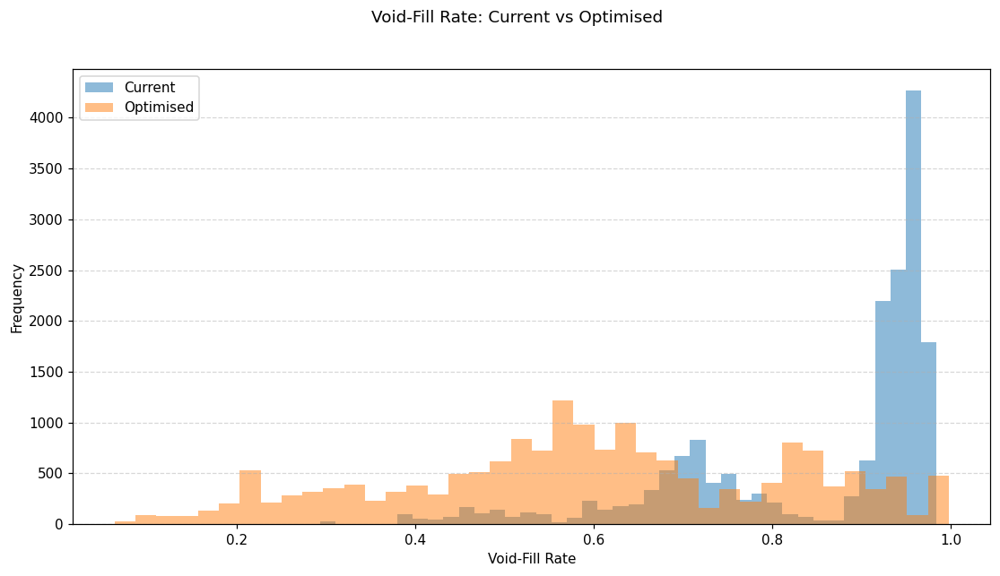
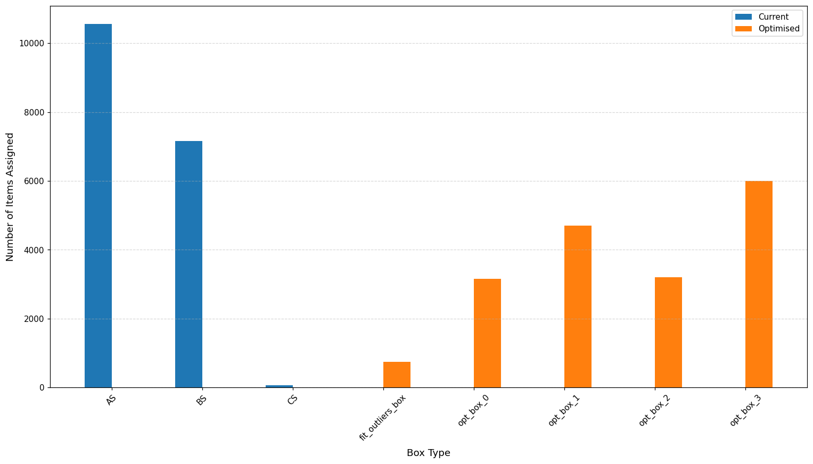
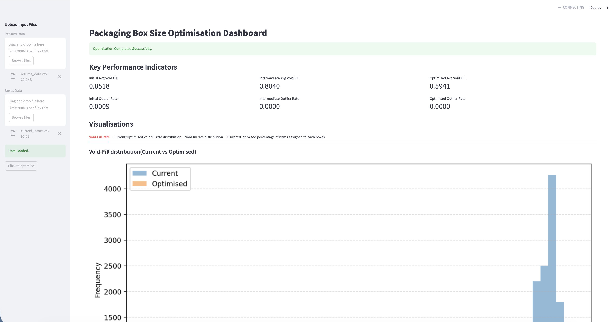

# Repackaging Optimisation - Box Dimension Sizing with K-Means

**Python-based void-fill and outlier reduction for a product repackaging process.**

This project reduces wasted space (void-fill) and eliminates un-packable items
(outliers) in a returns-repackaging operation. It evaluates the current set of
packaging boxes, then uses K-Means clustering to design a smaller, better-fitting
set of box sizes.

 **Note on data:** The original coursework was built on confidential SKU data
 supplied to us by an industry client through Lancaster University Management
 School. That data is not included here. This public version ships with a
 synthetic dataset (`generate_synthetic_data.py`) of the same structure and
 the same behaviour as the original, so the full pipeline and dashboard run
 end-to-end out of the box. The headline results quoted below are the results
 achieved on the real client data, the synthetic dataset reproduces the same
 pattern (see sample output).

---

## Results on the real client dataset

| Configuration | Avg void-fill rate (KPI-1) | Outlier rate (KPI-2) |
|---|---|---|
| Current boxes | 0.851 | 0.0015 |
| K-Means centroids (first method) | 0.803 | 0.000 |
| Quantile K-Means (final method) | 0.760 | 0.000 |

The final method cut average void-fill by roughly 11 percentage points and
removed 100% of outliers (every returned item became packable).

---

## Method

Two optimisation approaches are implemented and compared:

1. **K-Means centroids:** cluster the SKU dimensions and use each cluster
   centroid directly as a box size.
2. **Quantile-based K-Means (final):** cluster the SKUs, then size each box to
   the 90th percentile of the L, W, H within its cluster. Sizing to a high
   percentile rather than the mean makes each box comfortably fit almost every
   item in its cluster, which is what drives the lower void-fill.

Both methods add a single **catch-all box** sized to the largest SKU, guaranteeing
the outlier rate is zero. Minimum-dimension constraints keep every box
manufacturable.

---

## Repository structure

```
.
├── box.py                    # Box class: volume, fit check, box selection
├── sku_dims_cls.py           # SKU dimension sorting + largest-SKU (catch-all) helper
├── current_box_fit.py        # PackingOptimiser: expands units, assigns boxes, computes KPIs
├── kmeans_original.py        # BoxDimensionsOptimiserK: centroid-based sizing
├── optimise_kmeans.py        # BoxDimensionsOptimiser: quantile-based sizing (final)
├── dashboard.py              # Streamlit dashboard (KPIs + visualisations)
├── generate_synthetic_data.py# Creates synthetic returns_data.csv & current_boxes.csv
├── images/                   # Generated charts for this README
└── data_files/               # Synthetic CSVs work here (real client data is git-ignored)
```

### Data schema

`returns_data.csv` → `sku_id, l, w, h, quantity`
`current_boxes.csv` → `box_id, l, w, h`
All dimensions are in millimetres. `quantity` expands each SKU line into individual units.

### KPIs

**KPI-1 (Average void-fill rate):**  `1 − (V_SKU / V_box)`, averaged over all packed units. Lower is better.

**KPI-2 (Outlier rate):**  fraction of units that fit in no box. Target is 0.

---

## How to run

**1. Install dependencies**
```bash
pip install -r requirements.txt
```

**2. Generate the synthetic dataset**
```bash
python generate_synthetic_data.py
```
This writes `data_files/returns_data.csv` and `data_files/current_boxes.csv`.

**3a. Run the pipeline from a Python shell**
```python
from sku_dims_cls import SkuDims
from current_box_fit import PackingOptimiser
from optimise_kmeans import BoxDimensionsOptimiser
from kmeans_original import BoxDimensionsOptimiserK
import pandas as pd

returns_data  = pd.read_csv('./data_files/returns_data.csv')
current_boxes = pd.read_csv('./data_files/current_boxes.csv')

returns_sorted = SkuDims(returns_data).sort_dims()

# Current configuration
initial = PackingOptimiser(returns_data=returns_sorted, current_boxes=current_boxes).assign_boxes()
print("Initial :", round(initial['avg_void_fill_rate'], 4), round(initial['outlier_rate'], 4))

# Centroid method
inter = BoxDimensionsOptimiserK(returns_data=returns_sorted, current_boxes=current_boxes).optimise_box_sizes()
print("Centroid:", round(inter['avg_void_fill_rate'], 4), round(inter['outlier_rate'], 4))

# Quantile method (final)
final = BoxDimensionsOptimiser(returns_data=returns_sorted, current_boxes=current_boxes).optimise_box_sizes()
print("Quantile:", round(final['avg_void_fill_rate'], 4), round(final['outlier_rate'], 4))
```

**3b. Or launch the dashboard**
```bash
streamlit run dashboard.py
```
Upload the two CSVs from `data_files/` in the sidebar and click "Click to optimise".

---

## Sample output (synthetic data)

```
Initial   void 0.8518   outlier 0.0009
Centroid  void 0.8040   outlier 0.0000
Quantile  void 0.5941   outlier 0.0000
```

The synthetic run mirrors the real project: high initial void-fill, an intermediate centroid result, a clear win from the quantile method, and outliers driven to zero. Exact figures move slightly with the random seed.

### Void-fill distribution: current vs optimised


### Items assigned per box: current vs optimised


---

## Authors

- **Deepak Sharma** - MSc Business Analytics, Lancaster University Management School
- **Donovan Crasta** - MSc Business Analytics, Lancaster University Management School
- **Pratik Baingane** - MSc Business Analytics, Lancaster University Management School

Licensed under the MIT License - see `LICENSE`.

### Live dashboard

